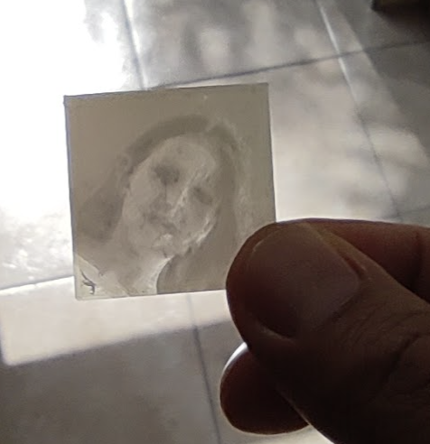
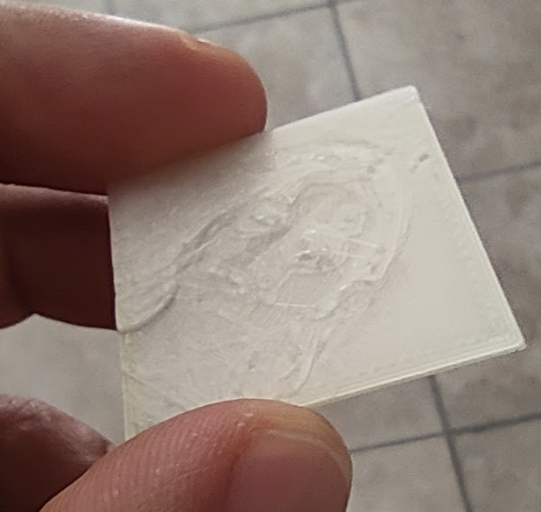

**pngtostl** is a program that converts a PNG image into a 3D model *negative*,
in STL format, suitable to be printed by entry level 3D printers.

## What is a 3D model negative?

It's a piece of plastic (3D printed plastic, usually) that is thicker
in correspondence of places where the original image is darker, and thinner in
correspondence of places where the original image is lighter. Putting this 3D
model negative between the observer and a light source (for instance the
daylight sun, a lamp, ...) will show the original image, because the parts
where the plastic is thicker will let less light to flow from one side to
the other. It's like "developing" a photo negative :)

This is really one of those cases where an image is worth more than words:





The above examples were printed using a Prusa Mini printer, using the STL file
generated by pngtostl and sliced using PrusaSlicer.

## Usage

Compile with `make` (you need libpng). Then use like this:

    ./pngtostl image.png > model.stl

Warning: use reltaively low resolution images, if the image is big resize it, otherwise the resulting STL file will be huge without any good reason. Most printers can't go over a given (small) resolution anyway. Do a first try with a very small image, like 300x300 pixels, then move to larger images as you want to print larger negatives.

By default the generated model will use 1x1 millimeters per pixel, 20 "levels"
(different heights) to generate 20 levels of grey, and will produce a model with
total height of 1.2 millimeters: 0.2 millimeters base, 1 millimeter to reproduce
the greys.

The conversion to greyscale works just taking the average of RGB pixels, and the
20 greys are selected by normalizing the image min/max luminosity, and mapping
the greys (heights) linearly.

Note that after you import the STL in the slicer, you'll likely have to reduce
its size, unless the image is tiny. This would produce a model that is too "flat"
so you'll have to stretch it to reach 1 or 2 millimeters of height at least: this
depends on the layer height you selected in the slicer. If you have a .10 layer
height, and a model total height of 1.2 millimeters, only 10 different levels
will be printed (0.2 is lost in the base), and so forth.

Using the program options you can change all the sttings discussed above:

```
./pngtostl --help
png2stl image.png [... options ...]
  --relief-height <mm> | Relief height.      Default: 1 mm
  --base-height <mm>   | Fixed base height.  Default: .2 mm
  --levels             | Number of different levels (heights/greys). Default: 20
  --negative           | Use thicker plastic for black (default).
  --positive           | Use thicker plastic for white.
```

## Generating positive images

The default is to produce a negative model that you can *develop* putting it
in front of a light source, but the program also supports the other mode, where
the lighter parts of the image will be the one with the greater height in the
plastic model.

This mode is activated by using the `--positive` option. This mode is thought
to be used with color change during the print. I'll hope to produce a proper
experiment with it and add a picture here.

## STL generation

This program was written in about 1 hour (it took me more time to do the test
and write this README file!) so is very limited and not very optimized.
Every pixel is a separated box, this makes its internals a lot simpler but
will produce more triangles, and the STL files will be very big.

Every pixel will generate a box that is composed of 12 triangles. Normals
are not set in the STL file, instead the right hand rule is used in order
to ensure that all the triangles in a box will point outwards.

## License

This program is free software released under the BSD 2-clause license.
